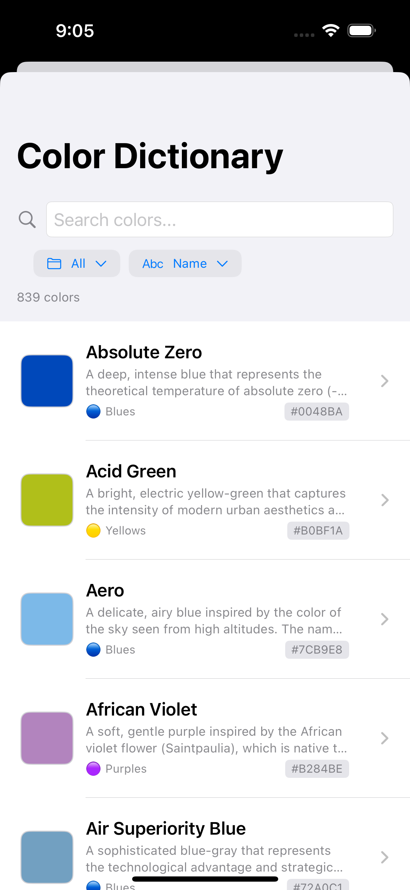

# Hue Knew 🎨

<!-- START doctoc generated TOC please keep comment here to allow auto update -->
<!-- DON'T EDIT THIS SECTION, INSTEAD RE-RUN doctoc TO UPDATE -->

- [Hue Knew 🎨](#hue-knew-)
  - [🎯 Goal](#goal)
  - [📸 Screenshots](#screenshots)
  - [📔 Game Overview](#-game-overview)
    - [📚 Learning Phase](#-learning-phase)
    - [🎮 Challenge Phase](#-challenge-phase)
  - [🌟 Features](#-features)
  - [🎨 Color Categories](#-color-categories)
  - [🏆 Learning Objectives](#-learning-objectives)
  - [🎮 How to Play](#-how-to-play)
  - [🔮 Future Enhancements](#-future-enhancements)
  - [📄 License](#-license)
  - [🙏 Acknowledgments](#-acknowledgments)
- [Development](#development)
  - [🤝 Contributing](#-contributing)
  - [🔧 Technical Details](#-technical-details)
  - [📱 Requirements](#-requirements)
  - [🚀 Getting Started](#-getting-started)

<!-- END doctoc generated TOC please keep comment here to allow auto update -->

The ability for humans to observe and record memories of the world is limited by the language they have to describe it.

Hue Knew is an open-source SwiftUI color learning game that helps humans discover new colors, learn the subtle differences between similar colors, and learn their proper names.

## 🎯 Goal

As a human, I want to be able to articulate the visual reality that humans experience with more accuracy. Rather than saying "that person is wearing a yellow-orange shirt with brown-ish accent lines," if I know the names of more colors, I can say, "that person is wearing a gamboge shirt with brown-sugar accent lines."

I want to be able to recognize colors in the real world and connect them to more distinct language.
I want to be able to hear a color name and visualize it in my mind.

## 📸 Screenshots

<p align="center">


</p>

<p align="center">



</p>

## 🎯 Game Overview

**Hue Knew** is designed to train your eye to distinguish between similar colors that are often confused, such as:

| Color Pair | Differences |
|------------|-------------|
|  **Gamboge** (#E49B0F) vs.  **Indian Yellow** (#E3B505) | • Gamboge is more orange and warmer<br>• Indian Yellow is slightly brighter and more yellow<br>• Gamboge has deeper, richer undertones |
|  **Prussian Blue** (#003153) vs.  **Oxford Blue** (#002147) | • Prussian Blue is slightly more green-tinted<br>• Oxford Blue has more purple undertones<br>• Prussian Blue is marginally lighter |
|  **Crimson** (#DC143C) vs.  **Firebrick** (#B22222) | • Crimson is brighter and more vibrant<br>• Firebrick is darker and more muted<br>• Crimson has a slight blue undertone |
|  **Purple** (#6A0DAD) vs.  **Midnight** (#702670) | • Purple is more saturated and vibrant<br>• Midnight is darker and more mysterious<br>• Purple has more blue undertones |
|  **Burnt Orange** (#CC5500) vs.  **Chocolate** (#D2691E) | • Burnt Orange is more orange and vibrant<br>• Chocolate is more brown and muted<br>• Burnt Orange is brighter and warmer |
|  **Yellow** (#FFFF00) vs.  **Lemon** (#FFF700) | • Yellow is pure and more saturated<br>• Lemon is slightly more green-tinted<br>• Yellow is brighter and more electric |
|  **Forest Green** (#228B22) vs.  **Hunter Green** (#355E3B) | • Forest Green is brighter and more vibrant<br>• Hunter Green is darker and more muted<br>• Forest Green has more yellow undertones |
|  **Dim Gray** (#696969) vs.  **Davy's Grey** (#555555) | • Dim Gray is lighter and more neutral<br>• Davy's Grey is darker and more saturated<br>• Dim Gray has a cooler undertone |

The game uses a progressive learning approach with two main phases:

### 📚 Learning Phase
- **Side-by-side comparison**: View two similar colors together with their names
- **Study the differences**: Learn the subtle variations that distinguish each color
- **Take your time**: No pressure - focus on understanding the nuances

### 🎮 Challenge Phase
- **Name-to-color matching**: Given a color name, select the correct hue
- **Color-to-name matching**: Given a color, choose the correct name
- **Multiple choice format**: Pick from carefully selected similar options
- **Immediate feedback**: Learn from mistakes with explanations

## 🌟 Features

- **Progressive difficulty**: Start with obvious differences, advance to subtle variations
- **Smart color pairs**: Curated color combinations that are commonly confused
- **Achievement system**: Track your progress and unlock new color categories
- **Streak tracking**: Monitor your learning momentum
- **Category-based learning**: Focus on specific color families (blues, yellows, reds, etc.)

## 🎨 Color Categories

- **Yellows**: Gamboge, Indian Yellow, Cadmium Yellow, Lemon Yellow, Saffron, Goldenrod
- **Blues**: Prussian Blue, Navy, Cerulean, Glaucous, Ultramarine, Cobalt Blue
- **Reds**: Crimson, Firebrick, Vermillion, Carmine, Burgundy, Venetian Red
- **Greens**: Forest Green, Hunter Green, Viridian, Malachite, Sage, Emerald
- **Purples**: Purple, Midnight, Royal Purple, Lavender, Amethyst, Byzantium
- **Oranges**: Burnt Orange, Chocolate, Cadmium Orange, Tangerine, Marigold, Persimmon
- **Neutrals**: Dim Gray, Davy's Grey, Silver, Platinum, Ivory, Charcoal

## 🏆 Learning Objectives

- **Develop color vocabulary**: Learn proper names for specific hues
- **Train visual discrimination**: Improve ability to spot subtle differences
- **Build confidence**: Reduce uncertainty when describing colors
- **Practical application**: Use knowledge in art, design, and daily life

## 🎮 How to Play

1. **Start with Learning Mode**: Choose a color category to study
2. **Compare colors**: Study two similar colors side-by-side
3. **Read the differences**: Learn what makes each color unique
4. **Take the challenge**: Test your knowledge with randomized questions
5. **Track progress**: Build streaks and unlock new categories


## 🔮 Future Enhancements

- **Custom color sets**: Import your own color palettes
- **Timed challenges**: Speed rounds for advanced users
- **Color blindness support**: Accommodations for different vision types
- **Social features**: Share progress and compete with friends
- **Advanced analytics**: Detailed learning progress tracking

## 📄 License

This project is licensed under the HueKnew License - see the [LICENSE.md](LICENSE.md) file for details. Contribute to this project via a fork or issue on github :)

## 🙏 Acknowledgments

- Color definitions sourced primarily from the Wikipedia pages but curated and tailored with aggregate LLM knowledge:
 - https://en.wikipedia.org/wiki/List_of_colors:_A%E2%80%93F
 - https://en.wikipedia.org/wiki/List_of_colors:_G%E2%80%93M
 - https://en.wikipedia.org/wiki/List_of_colors:_N%E2%80%93Z
- Thanks to [Placehold.co](https://placehold.co/) for the color swatch previews in this file and other places :)


# Development

## 🤝 Contributing

Contributions are welcome! Please feel free to submit a Pull Request or simply file an issue and we will get to work on it!

## 🔧 Technical Details

- **Platform**: iOS 18.2+
- **Framework**: SwiftUI
- **Architecture**: MVVM with @Observable
- **Language**: Swift 5.9

## 📱 Requirements

- iOS 18.2 or later
- Xcode 16.0 or later
- Swift 5.9 or later

## 🚀 Getting Started

1. Clone the repository:
   ```bash
   git clone https://github.com/atomantic/HueKnew.git
   cd HueKnew
   ```

2. Open the project in Xcode:
   ```bash
   open "HueKnew.xcodeproj"
   ```

3. Build and run the project on a simulator or device
