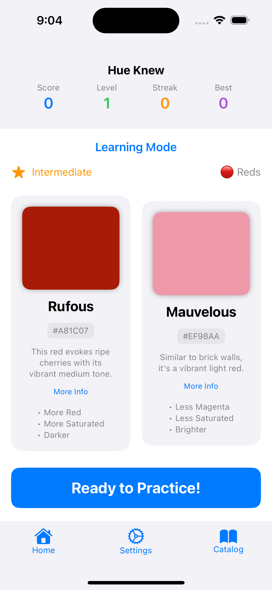
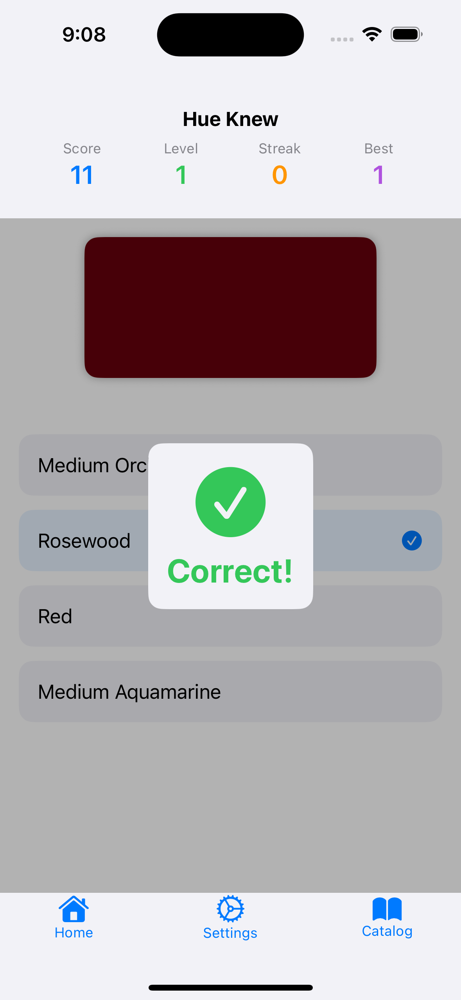

# Hue Knew 🎨

Your ability to understand the world is limited by the language you have to describe it. Expand your world!

An open-source SwiftUI color learning game that helps you discover the subtle differences between similar colors and learn their proper names.

## Screenshots

<p align="center">


</p>

<p align="center">


</p>

<p align="center">


</p>

## 🎯 Game Overview

**Hue Knew** is designed to train your eye to distinguish between similar colors that are often confused, such as:
- Gamboge vs. Indian Yellow
- Muted Glaucous vs. Winter Glaucous
- Vermillion vs. Cinnabar
- Prussian Blue vs. Navy Blue

The game uses a progressive learning approach with two main phases:

### 📚 Learning Phase
- **Side-by-side comparison**: View two similar colors together with their names
- **Study the differences**: Learn the subtle variations that distinguish each color
- **Take your time**: No pressure - focus on understanding the nuances

### 🎮 Challenge Phase
- **Name-to-color matching**: Given a color name, select the correct hue
- **Color-to-name matching**: Given a color, choose the correct name
- **Multiple choice format**: Pick from carefully selected similar options
- **Immediate feedback**: Learn from mistakes with explanations

## 🌟 Features

- **Progressive difficulty**: Start with obvious differences, advance to subtle variations
- **Smart color pairs**: Curated color combinations that are commonly confused
- **Achievement system**: Track your progress and unlock new color categories
- **Streak tracking**: Monitor your learning momentum
- **Category-based learning**: Focus on specific color families (blues, yellows, reds, etc.)

## 🎨 Color Categories

- **Yellows**: Gamboge, Indian Yellow, Cadmium Yellow, Lemon Yellow
- **Blues**: Prussian Blue, Navy, Cerulean, Glaucous variations
- **Reds**: Vermillion, Cinnabar, Cadmium Red, Alizarin
- **Greens**: Viridian, Malachite, Forest Green, Sage
- **And many more...**

## 🏆 Learning Objectives

- **Develop color vocabulary**: Learn proper names for specific hues
- **Train visual discrimination**: Improve ability to spot subtle differences
- **Build confidence**: Reduce uncertainty when describing colors
- **Practical application**: Use knowledge in art, design, and daily life

## 🔧 Technical Details

- **Platform**: iOS 18.5+
- **Framework**: SwiftUI
- **Architecture**: MVVM with @Observable
- **Language**: Swift 5.9

## 📱 Requirements

- iOS 18.5 or later
- Xcode 16.0 or later
- Swift 5.9 or later

## 🚀 Getting Started

1. Clone the repository:
   ```bash
   git clone https://github.com/atomantic/HueKnew.git
   cd HueKnew
   ```

2. Open the project in Xcode:
   ```bash
   open "HueKnew.xcodeproj"
   ```

3. Build and run the project on a simulator or device

## 🎮 How to Play

1. **Start with Learning Mode**: Choose a color category to study
2. **Compare colors**: Study two similar colors side-by-side
3. **Read the differences**: Learn what makes each color unique
4. **Take the challenge**: Test your knowledge with randomized questions
5. **Track progress**: Build streaks and unlock new categories


## 🔮 Future Enhancements

- **Custom color sets**: Import your own color palettes
- **Timed challenges**: Speed rounds for advanced users
- **Color blindness support**: Accommodations for different vision types
- **Social features**: Share progress and compete with friends
- **Advanced analytics**: Detailed learning progress tracking

## 🤝 Contributing

Contributions are welcome! Please feel free to submit a Pull Request. For major changes, please open an issue first to discuss what you would like to change.

## 📄 License

This project is licensed under the MIT License - see the [LICENSE.md](LICENSE.md) file for details.

## 🙏 Acknowledgments

- Color definitions sourced from various art and design references
- Inspired by the need to improve color literacy in creative fields
- Built with SwiftUI and modern iOS development practices

---

**Happy color learning!** 🌈
